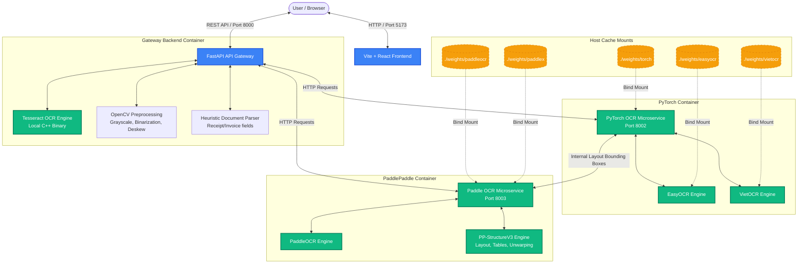

# OCR Playground 🚀
### Interactive OpenCV Preprocessing & Microservices-based OCR Evaluation Stack

OCR Playground is a production-grade interactive web application designed to help developers experiment with **OpenCV image preprocessing filters**, compare the performance of multiple state-of-the-art OCR engines (**Tesseract, EasyOCR, VietOCR, PaddleOCR, and PP-StructureV3**), and analyze heuristic document extraction workflows (e.g. for receipts, invoices, and business cards).

It is built on a **consolidated microservices architecture** orchestrated via Docker Compose, utilizing host bind mounts for model weights to keep container builds fast, clean, and offline-compatible.

---

## 🏛️ System Architecture

The project decouples compute-heavy machine learning runtimes (PyTorch, PaddlePaddle) and lightweight tasks (Tesseract, OpenCV) into distinct microservices to optimize performance, memory allocation, and build times.

### Unicode System Diagram (Plain Text)
```text
+--------------------------------------------------------------------------------+
|                                  USER / BROWSER                                |
+---------------------------------------+----------------------------------------+
                                        | HTTP / Port 5173 (Vite + React)
                                        v
+--------------------------------------------------------------------------------+
|                        FRONTEND UI (React + Tailwind)                          |
+---------------------------------------+----------------------------------------+
                                        | API Request (Base64 Image + Config)
                                        v
+--------------------------------------------------------------------------------+
|                     FASTAPI API GATEWAY (Port 8000)                            |
+-------------------+-------------------+-------------------+--------------------+
                    |                   |                   |
                    | local calls       | Port 8002         | Port 8003
                    v                   v                   v
+-----------------------+   +-------------------+   +----------------------------+
|  TESSERACT OCR ENGINE |   |    PYTORCH SERVICE|   |       PADDLE SERVICE       |
|  - Local C++ Binary   |   |   - EasyOCR       |   |   - PaddleOCR              |
|                       |   |   - VietOCR       |   |   - PP-StructureV3         |
|                       |   |                   |   |     (Layout, Tables, etc.) |
+-----------------------+   +-------------------+   +----------------------------+
                                      ^                           ^
                                      |                           |
                                      | Bind Mounts               | Bind Mounts
                                      v                           v
                            +-------------------+   +----------------------------+
                            | ./weights/easyocr |   | ./weights/paddleocr        |
                            | ./weights/vietocr |   | ./weights/paddlex          |
                            | ./weights/torch   |   |                            |
                            +-------------------+   +----------------------------+
```

### Flowchart Diagram (Mermaid)


### Microservice Directory Structure
```
ocr-playground/
├── backend/                  # API Gateway & Preprocessing Service
│   ├── image_filters.py      # OpenCV image processing filters
│   ├── structured_parser.py  # Receipt heuristic key-field extraction
│   └── app.py                # Gateway router
├── frontend/                 # React UI Dashboard (Vite)
├── ocr-pytorch/              # PyTorch Container (EasyOCR & VietOCR)
├── ocr-paddle/               # PaddlePaddle Container (PaddleOCR & PP-StructureV3)
├── weights/                  # Persistent host-cached directory for model weights
└── download_weights.py       # Host-based pre-download script for weight files
```

---

## ✨ Key Features

1. **Interactive OpenCV Filters (Live)**: Adjust sliders (Grayscale, Brightness/Contrast, Otsu/Adaptive Thresholds, Dilation/Erosion) in the UI and preview the processed image instantly.
2. **Auto-Deskewing**: Automatically estimates skewed document angles via Hough Line Transforms and corrects orientation prior to text extraction.
3. **Decoupled Heavy Services**: Heavy PyTorch and PaddlePaddle frameworks run in isolated environments to prevent memory bloat on the Gateway.
4. **Adjacent Box Merging**: Backend intelligently groups word-level bounding boxes into larger sentences/lines using spatial proximity heuristics to preserve tabular document layouts.
5. **Heuristic Key-Field Extraction**: Identifies and organizes critical data fields (Merchant, Phone, Email, Date, Total Amount) from text inputs.
6. **Robust Host-Cached Weights**: Pre-downloaded weights are mounted via Docker volumes, making container execution fast, deterministic, and network-independent.

---

## ⚡ Setup & Deployment

### 📋 Prerequisites
* **Docker Desktop** installed.
* **Python 3.10+** installed on host machine (required only for running the pre-download weight script).

---

### 🚀 Step 1: Pre-download Model Weights (Host Machine)
Run this script on your host machine to download and cache all models locally into the `./weights/` folder. This keeps container sizes lightweight and prevents runtime connection issues.

```bash
# 1. Create host virtual environment and install weight-download requirements
python3 -m venv backend/.venv
source backend/.venv/bin/activate
pip install -r backend/requirements.txt
pip install -r ocr-pytorch/requirements.txt
pip install -r ocr-paddle/requirements.txt

# 2. Run the weight pre-downloader
python download_weights.py
```
All weights will be downloaded to `~/.cache`, `~/.EasyOCR`, and `~/.paddlex` and copied to the local `./weights` project folder.

---

### 🚀 Step 2: Spin up the Microservices Stack
Once weights are cached, spin up the entire Docker Compose stack:

```bash
./deploy.sh
```

This deployment script will:
* Build and start all 4 services in detached mode.
* Bind mount `./weights/` directories into their corresponding container cache paths (`/root/.EasyOCR`, `/root/.paddlex`, etc.).
* Set `FLAGS_use_mkldnn=0` on the Paddle container to prevent Apple Silicon CPU emulation segmentation faults (`SIGSEGV`).
* Validate health endpoints and confirm Gateway is online.

#### Services List
* **Frontend UI**: [http://localhost:5173](http://localhost:5173)
* **Gateway API**: [http://localhost:8000](http://localhost:8000)
* **API Documentation**: [http://localhost:8000/docs](http://localhost:8000/docs)
* **PyTorch Service (Internal)**: Port `8002`
* **Paddle Service (Internal)**: Port `8003`

To inspect the system logs at any time:
```bash
docker compose logs -f
```

To stop all services:
```bash
docker compose down
```

---

## 💡 Developers Guide: Adding Custom OCR Engines

The Gateway utilizes the **Strategy Pattern** to load and route OCR requests. To extend the stack with a new engine (e.g. your custom OCR model):

1. **Deploy your OCR microservice** (or install dependencies in `ocr-pytorch` or `ocr-paddle`).
2. Implement your endpoint handling logic inside the corresponding microservice's `app.py`.
3. In [`backend/app.py`](file:///Users/testadmin/Desktop/Desktop-Mac/ocr-playground/backend/app.py), map the new engine name to your microservice URL:

```python
# In backend/app.py (api_ocr endpoint)
if request.engine == 'custom_ocr':
    target_service_url = "http://your-new-service:8080/api/ocr"
```

All preprocessing, box merging, heuristic table rendering, and the React UI elements will seamlessly adapt to the new engine output!
