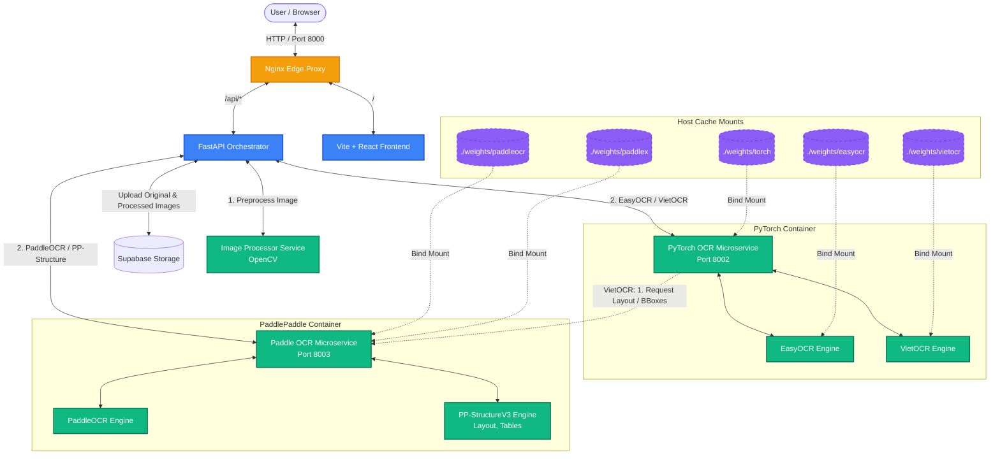
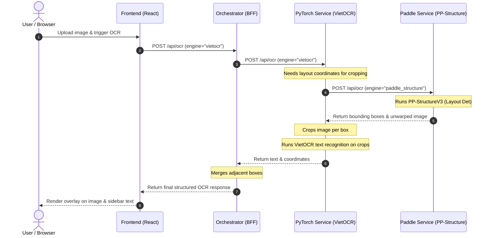

# OCR Playground 🚀
### Interactive OpenCV Preprocessing & Microservices-based OCR Evaluation Stack

OCR Playground is a production-grade interactive web application designed to help developers experiment with **OpenCV image preprocessing filters** and compare the performance of multiple state-of-the-art OCR engines (**EasyOCR, VietOCR, PaddleOCR, and PP-StructureV3**).

It is built on a **consolidated microservices architecture** orchestrated via Docker Compose, utilizing host bind mounts for model weights to keep container builds fast, clean, and offline-compatible. The system is architected around an Edge Proxy and a Backend-for-Frontend (BFF) Orchestrator for maximum scalability.

---

## 🏛️ System Architecture

The project decouples compute-heavy machine learning runtimes (PyTorch, PaddlePaddle), lightweight image processing tasks (OpenCV), and traffic routing into distinct microservices. It now also integrates **Supabase Storage** to handle image persistence, optimizing performance by returning lightweight public URLs instead of heavy Base64 strings to the frontend.

### Flowchart Diagram


### 🔄 VietOCR Hybrid Processing Pipeline
Because VietOCR excels at Vietnamese handwriting/printed line-level text recognition but lacks a layout detection layout module of its own, the stack implements a **hybrid cross-service orchestration flow**:



### 📂 Microservice Directory Structure
```
ocr-playground/
├── .env                      # Global security configurations (Supabase Keys)
├── nginx/                    # Edge Proxy Configuration
├── backend/                  # BFF Orchestrator Service
│   ├── routers/              # API Endpoints (system.py, ocr.py)
│   ├── services/             # Core Logic (supabase, orchestrator)
│   ├── const.py              # Extracted constants and URLs
│   └── app.py                # Gateway routing & CORS setup
├── image-processor/          # OpenCV image processing microservice
├── frontend/                 # React UI Dashboard (Vite)
├── ocr-pytorch/              # PyTorch Container (EasyOCR & VietOCR)
│   ├── const.py              # Extracted constants and URLs
│   └── app.py                
├── ocr-paddle/               # PaddlePaddle Container (PaddleOCR & PP-StructureV3)
├── weights/                  # Persistent host-cached directory for model weights
└── download_weights.py       # Host-based pre-download script for weight files
```

---

## ✨ Key Features

1. **Production-Ready Storage (Supabase)**: Uploads original and processed images directly to a Supabase bucket via `multipart/form-data`, passing lightweight public URLs to the frontend instead of massive Base64 strings.
2. **Interactive OpenCV Filters (Live Preview)**: Adjust sliders (Grayscale, Brightness/Contrast, Otsu/Adaptive Thresholds, Dilation/Erosion) in the UI and preview the processed image instantly (using ultra-fast local base64 passing for live preview without polluting storage).
3. **Auto-Deskewing**: Automatically estimates skewed document angles via Hough Line Transforms and corrects orientation prior to text extraction.
4. **Decoupled Heavy Services**: Heavy PyTorch, PaddlePaddle, and OpenCV tasks run in completely isolated environments to prevent memory bloat on the Orchestrator. Configuration is cleanly abstracted using `.env` and `const.py` files.
5. **Adjacent Box Merging**: Backend intelligently groups word-level bounding boxes into larger sentences/lines using spatial proximity heuristics to preserve tabular document layouts.
6. **Robust Host-Cached Weights**: Pre-downloaded weights are mounted via Docker volumes, making container execution fast, deterministic, and network-independent.

---

## ⚡ Setup & Deployment

### 📋 Prerequisites
* **Docker Desktop** installed.
* **Python 3.10+** installed on host machine (required only for running the pre-download weight script).

---

### 🚀 Step 1: Pre-download Model Weights (Host Machine)
Run this script on your host machine to download and cache all models locally into the `./weights/` folder. This keeps container sizes lightweight and prevents runtime connection issues.

```bash
# 1. Create host virtual environment and install weight-download requirements
python3 -m venv backend/.venv
source backend/.venv/bin/activate
pip install -r ocr-pytorch/requirements.txt
pip install -r ocr-paddle/requirements.txt

# 2. Run the weight pre-downloader
python download_weights.py
```
All weights will be downloaded to `~/.cache`, `~/.EasyOCR`, and `~/.paddlex` and copied to the local `./weights` project folder.

---

### 🚀 Step 2: Spin up the Microservices Stack
Once weights are cached, spin up the entire Docker Compose stack:

```bash
./deploy.sh
# or manually:
# docker-compose up --build -d
```

This deployment script will:
* Build and start all 5 services in detached mode.
* Use prod-like immutable service images by default.
* Bind mount only model weight directories into their corresponding container cache paths (`/root/.EasyOCR`, `/root/.paddlex`, etc.).
* Set `FLAGS_use_mkldnn=0` on the Paddle container to prevent Apple Silicon CPU emulation segmentation faults (`SIGSEGV`).

#### Services List
* **OCR Playground (Via Nginx)**: [http://localhost:8000](http://localhost:8000)
* **PyTorch Service (Internal)**: Port `8002`
* **Paddle Service (Internal)**: Port `8003`
* **Image Processor (Internal)**: Port `8004`

To inspect the system logs at any time:
```bash
docker compose logs -f
```

To stop all services:
```bash
docker compose down
```

### Local Development Override
For day-to-day development with source bind mounts and FastAPI reload enabled, run:

```bash
docker compose -f docker-compose.yml -f docker-compose.dev.yml up --build
```

The default `docker-compose.yml` is intentionally closer to production: no source bind mounts and no reload commands.

### Health Endpoints
Use these endpoints for smoke checks:

```bash
curl http://localhost:8000/health
curl http://localhost:8000/api/health/live
curl http://localhost:8000/api/health/ready
curl http://localhost:8000/api/status
```

`/api/status` returns `online`, `degraded`, or `offline` based on downstream service reachability.

### Storage Fallback
Supabase is best-effort by default. If Supabase is not configured or an upload fails, OCR still runs and the frontend receives base64 fallback data. The response includes:

* `metadata.storage_status`: `uploaded`, `failed`, or `disabled`
* `warnings`: non-fatal pipeline warnings

Set `STORAGE_REQUIRED=true` in `.env` if a deployment must fail startup when Supabase is not configured.

### Developer Checklist
Before opening a PR or shipping a local change:

```bash
cd frontend
npm ci
npm run lint
npm run build
cd ..
python3 -m pip install -r backend/requirements.txt -r backend/requirements-dev.txt
pytest tests
```

Then run a smoke test:

1. Start the stack with Docker Compose.
2. Check `/api/health/ready` and `/api/status`.
3. Upload a small image in the UI.
4. Run EasyOCR, PaddleOCR, PP-Structure, and VietOCR.
5. Repeat once with Supabase credentials removed and confirm the UI still renders via base64 fallback.

---

## 💡 Developers Guide: Adding Custom OCR Engines

The Orchestrator utilizes the **Strategy Pattern** to load and route OCR requests. To extend the stack with a new engine (e.g. your custom OCR model):

1. **Deploy your OCR microservice** (or install dependencies in `ocr-pytorch` or `ocr-paddle`).
2. Implement your endpoint handling logic inside the corresponding microservice's `app.py`.
3. In [`backend/app.py`](file:///Users/testadmin/Desktop/Desktop-Mac/ocr-playground/backend/app.py), map the new engine name to your microservice URL:

```python
# In backend/app.py
ENGINE_ROUTING_MAP = {
    'custom_ocr': "http://your-new-service:8080",
    # ...
}
```

All preprocessing, box merging, and the React UI elements will seamlessly adapt to the new engine output!
