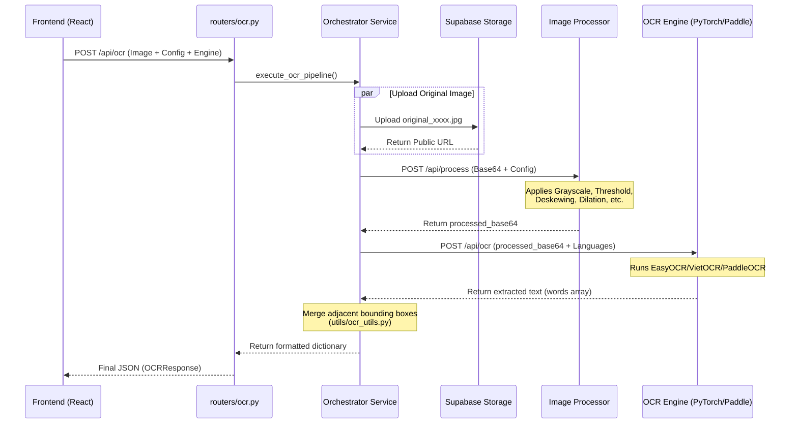

# OCR Playground Orchestrator (BFF)

## Overview
This FastAPI service acts as the **Backend-For-Frontend (BFF) orchestrator** for the OCR Playground. 

Instead of running heavy Machine Learning workloads directly, this service acts as a high-performance traffic director. It receives requests from the frontend, persists data to Supabase, coordinates image pre-processing, and delegates intensive OCR computation to dedicated, isolated microservices.

## Architecture & Clean Design

The codebase follows a strict **Clean Architecture** pattern to ensure separation of concerns:
- **`routers/`**: Handles HTTP request parsing, validation (via Pydantic), and routing.
- **`services/`**: Contains the core business logic (The Pipeline) and handles all external HTTP communications.
- **`utils/`**: Contains post-processing utilities (e.g., bounding box merging algorithms).

### Pipeline Execution Flow

When a user submits an image for OCR, the system executes the following asynchronous pipeline:



## Directory Structure

```text
backend/
├── app.py                # FastAPI entry point & CORS configuration
├── const.py              # Environment variables and internal routing URLs
├── schemas.py            # Pydantic models for request/response validation
├── routers/              # API Route definitions
│   ├── ocr.py            # OCR & Preprocessing endpoints
│   └── system.py         # Health check and configuration endpoints
├── services/             # Core business logic
│   ├── orchestrator_service.py # The sequential OCR execution pipeline
│   └── supabase_service.py     # Supabase object storage integration
└── utils/                # Post-processing modules
    └── ocr_utils.py      # Spatial algorithms for merging adjacent text boxes
```

## Key Dependencies
- **FastAPI & Uvicorn**: High-performance async web framework.
- **HTTPX**: Non-blocking asynchronous HTTP client for calling the microservices.
- **python-multipart**: Handles `multipart/form-data` for file uploads from the browser.
- **python-dotenv**: Loads secrets and configurations securely from the root `.env` file.
