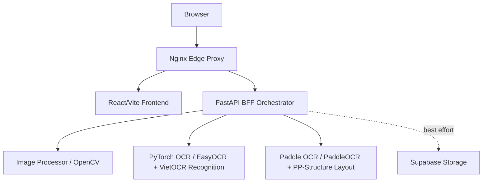

# OCR Playground Architecture

## Container View

## Service Boundaries

- The BFF owns workflow orchestration, routing, storage fallback, box merging, and frontend-facing response shape.
- `ocr-pytorch` owns PyTorch model loading and recognition only. VietOCR receives layout boxes from the BFF.
- `ocr-paddle` owns PaddleOCR text detection/recognition and PP-Structure layout/table extraction.
- `image-processor` owns OpenCV preprocessing only.
- Supabase Storage is a best-effort integration. OCR should still complete with base64 fallback when storage is disabled or failing.

## Runtime Notes

- `docker-compose.yml` is prod-like: immutable service images, healthchecks, no source bind mounts.
- `docker-compose.dev.yml` adds source bind mounts and reload commands for local development.
- Service contracts live in `shared/contracts.py` and are validated by lightweight tests that do not require model weights.

